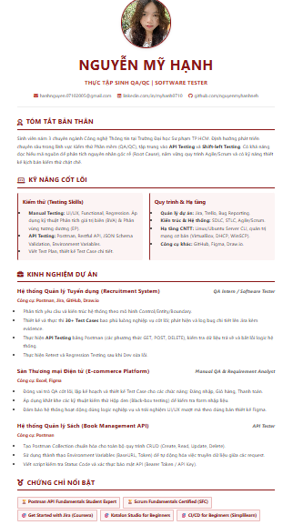

# 🌐 Personal Portfolio - QA/QC Intern

**Link Website:** [https://nguyenmyhanhneh.github.io/](https://nguyenmyhanhneh.github.io/)

Đây là mã nguồn trang web Portfolio cá nhân của Nguyễn Mỹ Hạnh, được xây dựng bằng HTML/CSS và triển khai (deploy) miễn phí thông qua GitHub Pages.

## 📌 Nội dung Portfolio bao gồm:
1. **Giới thiệu:** Tóm tắt bản thân, định hướng QA/QC và tư duy Shift-left Testing.
2. **Dự án:** Các dự án thực chiến (Recruitment System, E-commerce Platform, Book Management API).
3. **Chứng chỉ:** Postman Student Expert, Scrum SFC, v.v.
4. **Liên hệ:** Thông tin Email, LinkedIn, GitHub.

## 🚀 Quá trình thực hiện
- **Bước 1:** Khởi tạo Repository với định dạng `nguyenmyhanhneh.github.io`.
- **Bước 2:** Xây dựng cấu trúc giao diện dạng CV bằng HTML và định dạng CSS (Tone màu Đỏ đô).
- **Bước 3:** Tải các tài nguyên (hình ảnh avatar) lên thư mục `images/`.
- **Bước 4:** Commit code và cấu hình kích hoạt nhánh `main` trên GitHub Pages.

## 📸 Hình ảnh giao diện

